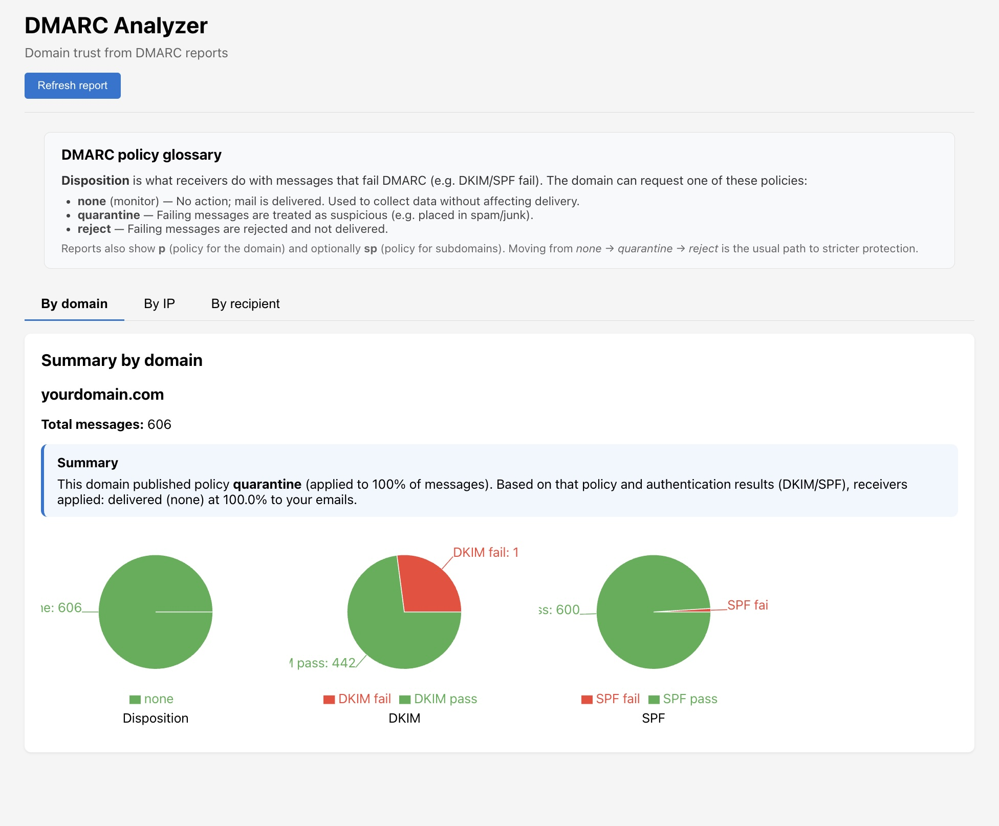

# DMARC-ANALYSER

A quick tool to analyze your tons of DMARC report files

## Requirements
Docker installed

## How to use

1. Clone the repository
2. Set you DMARC reports folder (input) on `.env` file (see env.example)
3. From project root run

```bash
docker compose up -d
```
4. Navigate to `http://localhost:3000`

## Adding more input files

Press "Refresh Report" for reading new DMARC report files


# Screenshots

On the example, multiple `.gz` and `.zip` files downloaded from DAMRC report files sent by Google, Hotmail, etc. were added to `DMARC_DIR` folder

You don't need to uncompress them, just download them from your email client, drop them in the `DMARC_DIR` folder and press "Refresh report" button

